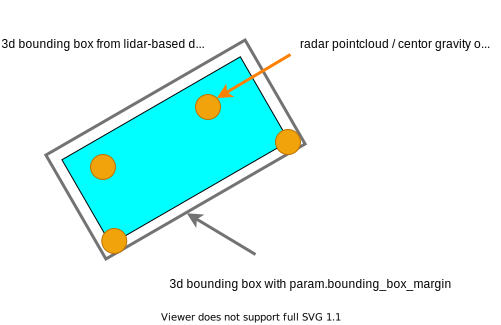
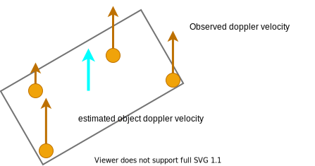
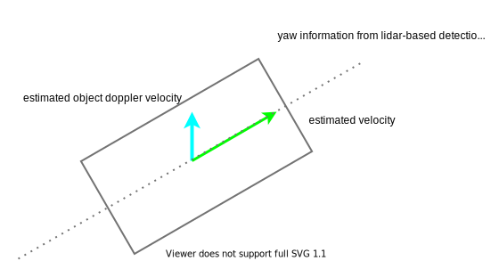
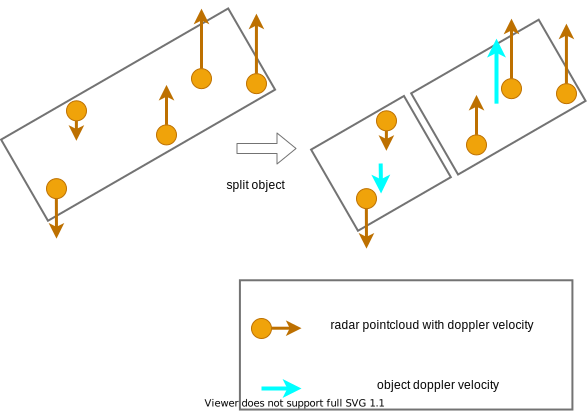
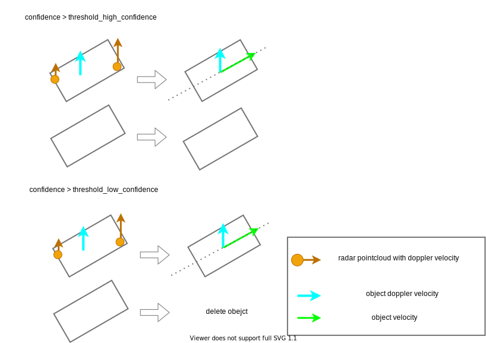
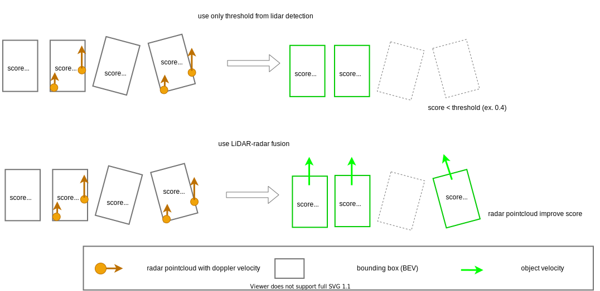

# radar_fusion_to_detected_object

This package is radar-based sensor fusion module to 3d detected object.
Main feature of this package are as following.

- Attach velocity to lidar detection result from radar data to improve for tracking result and planning like adaptive cruise.
- Improve detection result with radar sensor information. If both lidar 3d bbox low score and high RCS of radar pointcloud, then improve score of object.

## Interface
### radar_object_fusion_to_detected_object

Sensor fusion with radar objects and a detected object.

- Caliculation cost is O(nm).
  - n: the number of radar objects.
  - m: the number of objects from 3d detection.

#### How to launch

```sh
roslaunch radar_fusion_to_3dbbox radar_object_to_3dbbox.launch
```

#### Input / Output

- Input
    - `~/input/objects` (autoware_auto_perception_msgs/msg/DetectedObject.msg): 3d detected object.
    - `~/input/radar_objects` (autoware_auto_perception_msgs/msg/TrackedObjects.msg)
- Output
    - `~/output/objects` (autoware_auto_perception_msgs/msg/DetectedObjects.msg): 3d detected object with twist.

#### Parameters

### Common Algorithm

- 1. Choose radar pointcloud/object within 3d bounding box from lidar-base detection with margin space from bird eye view.



- 2. Estimate doppler velocity of object



- 3. Compensate ego vehicle twist
- 4. If object confidence of lidar-based detection is high, attach object to twist information.



- 5. If object confidence of lidar-based detection is low,
    - 4.1. and if an object estimate to derive two object, split two object
    - 4.2. and if there are some radar point/object within 3d bounding box from lidar-base detection, attach object to twist information.
    - 4.3. and if there are not any radar point/object within 3d bounding box from lidar-base detection, delete the object.






