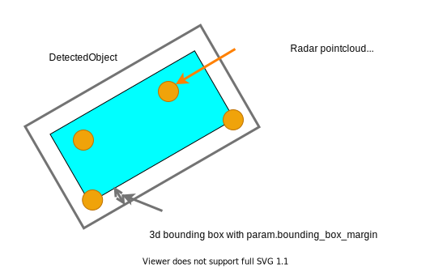
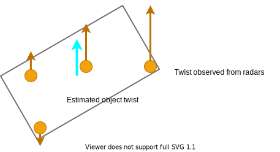
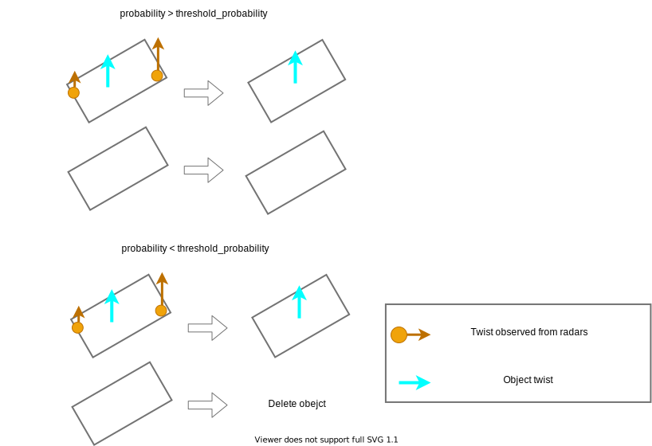
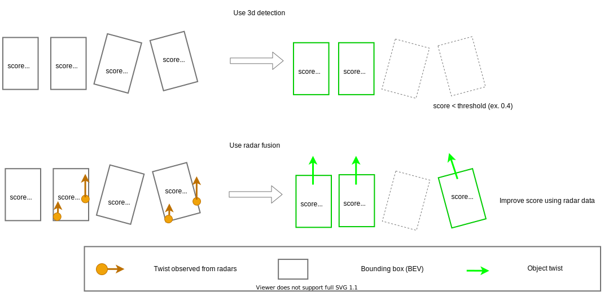

## Common Algorithm
### 1. Link between 3d bounding box and radar data

Choose radar pointcloud/objects within 3d bounding box from lidar-base detection with margin space from bird eye view.

### 2. Estimate twist of object

Estimate twist from choosed radar pointcloud/objects.
Attach object to twist information of estimated twist.

### 3. [Option] Convert doppler velocity to twist

If the twist information of radars is doppler velocity, convert from doppler velocity to twist using yaw angle of DetectedObject.

### 4. If an object confidence of lidar-based detection is low, fix the object.

- Split two object for the low confidence object that can be estimated to derive two object.

- Delete low confidence objects that do not have some radar points/objects.

