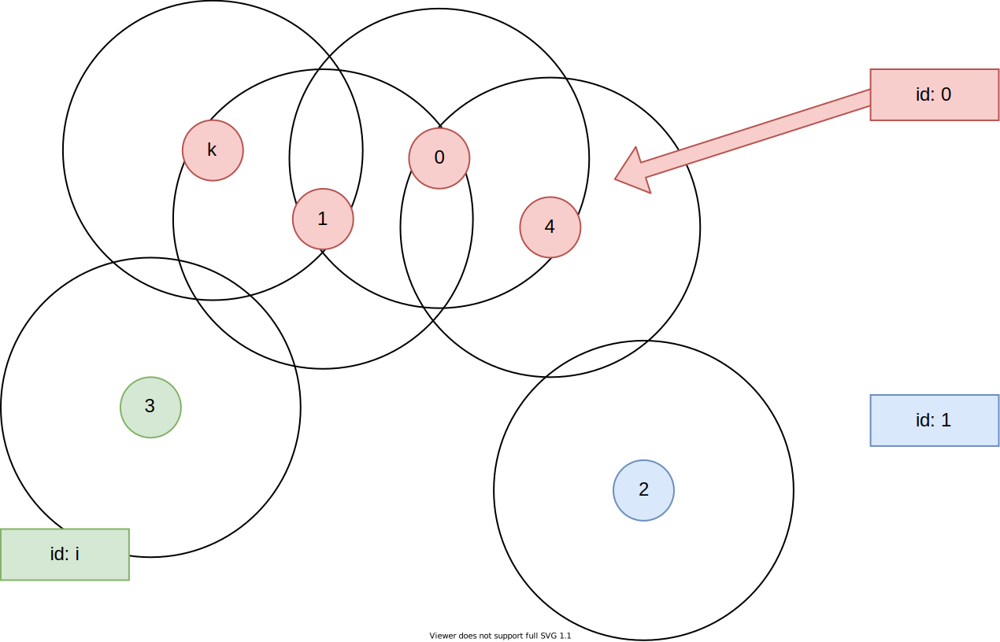
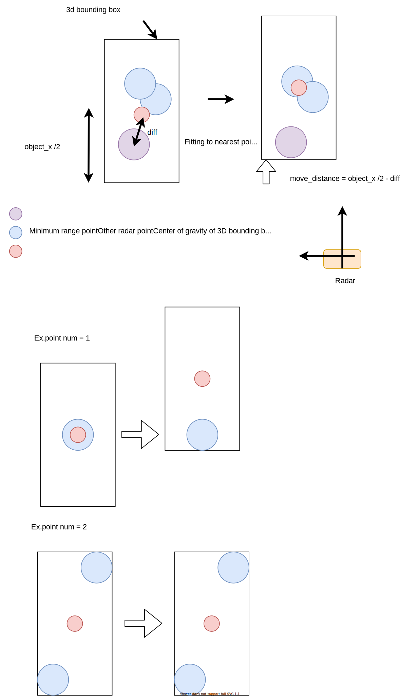

# radar_object_tracking

## radar_object_detection_node

- Clustering radar dynamic pointcloud
- Publish to 3d bounding box to detection far object
    - Radar detection range (If use long range radar, detection distance is about 200m)
    - Include near object (But do not use for detection with sensor fusion)
- Future
    - multi-frame detection
- Calculation cost O(t n^2)
    - n: the number of radar pointcloud
    - t: the frame number for multi-frame detection

### Input topics

| Name        | Type                | Description                                                                          |
| ----------- | ------------------- | ------------------------------------------------------------------------------------ |
| input/radar | autoware_radar_msgs | Radar dynamic pointcloud after removing noise (Long Range Radar + Short Range Radar) |

### Output topics

| Name          | Type                     | Description                             |
| ------------- | ------------------------ | --------------------------------------- |
| output/object | autoware_perception_msgs | 3d bounding box to detection far object |

### Parameters

| Name                   | Type   | Description                                                                                                                                                                |
| ---------------------- | ------ | -------------------------------------------------------------------------------------------------------------------------------------------------------------------------- |
| update_rate            | double | Update frame rate [hz]                                                                                                                                                     |
| num_frame              | int    | Number of frame                                                                                                                                                            |
| clustering_range       | double | Searching distance for DBSCAN, set to what want to detect (default set the size of car) [m]                                                                                |
| min_sigma_doppler      | double | Minimum doppler velocity variance to use clustering. If difference of doppler velocity between near pointclouds) > 3 \* standard deviation, then not clustering  [(m/s)^2] |
| min_sigma_range        | double | Minimum range variance for old frame clustering [m^2]                                                                                                                      |
| max_object_acc         | double | Maximum object acceleration for old frame clustering [m/s^2]                                                                                                               |
| min_object_x           | double | Minimum x size of object (default set the size of car) [m]                                                                                                                 |
| min_object_y           | double | Minimum y size of object (default set the size of car) [m]                                                                                                                 |
| min_object_z           | double | Minimum z size of object (default set the size of car) [m]                                                                                                                 |
| object_confidence      | double | Confidence as perception's object                                                                                                                                          |
| noise_thereshold_frame | int    | Sum of old frames which have clustering pointcloud < "noise_thereshold_frame", the id is noise point.                                                                      |

### How to launch

```sh
roslaunch radar_object_detection radar_object_detection.launch
```

### Algorithm

#### 1. Ego position modification

- [Under construction]
- Update position of old radar pointclouds by using ego vehicle twist

#### 2. Clustering pointcloud

- Clustering for radar pointcloud using something like DBSCAN algorithm



- cluster table

```
std::vector<std::vector<std::vector<int>>> cluster_id;
//! cluster_id[cluster_index][frame_index][clustered_point_index] = point_index
```

| id \ frame | 0 (now)    | 1 (1 old frame) | ..  | t (t old frame) |
| ---------- | ---------- | --------------- | --- | --------------- |
| 0          | 0, 1, 4, k |                 |     |                 |
| 1          | 2          |                 |     |                 |
| ..         |            |                 |     |                 |
| i          | 3          |                 |     |                 |
| ..         |            |                 |     |                 |
| n          |            |                 |     |                 |

- Pointclouds array

```
std::vector<autoware_radar_msgs::RadarPointcloudArray> buffer_points;
//! Point: buffer_points[frame_index].radar_pointclouds[point_index]
```

| frame | 0 (now)                                         | ..  | t (t old frame)                                 |
| ----- | ----------------------------------------------- | --- | ----------------------------------------------- |
|       | buffer_points[0].radar_pointclouds[point_index] |     | buffer_points[t].radar_pointclouds[point_index] |

#### 3. Clustering oldframe pointcloud

- Clustring for old frame pointcloud using something like DBSCAN algorithm
- For each clustered pointcloud, searching near old pointcloud like "2. clustering pointcloud" using doppler velocity
- When clustering old frame pointcloud, pointcloud can belong to multiple id
    - ex. In below table, point "2" in 1 old frame belong to id 0 and 1

| id \ frame | 0 (now)    | 1 (1 old frame) | ..  | t (t old frame) |
| ---------- | ---------- | --------------- | --- | --------------- |
| 0          | 0, 1, 4, k | 0,2             |     |                 |
| 1          | 2          | 2,3             |     |                 |
| ..         |            |                 |     |                 |
| i          | 3          | 3,5             |     |                 |
| ..         |            |                 |     |                 |
| n          |            |                 |     |                 |

#### 4. Remove noise pointcloud

- For each id, counting old frames which have clustering pointcloud.
- If sum of the frames < "noise_thereshold_frame", the id is noise point.

#### 5. Make 3d bounding box

1. Yaw estimation
    - simgle frame mode
        - Calculate yaw angle using moment
        - If clustering id has only one point, yaw = 0.
    - Multi-frame mode
        - [Under developmet]
2. Fitting 3d bounding box
    - Move to object's center point to where minimum range point come to close side of the object



#### 6. 
