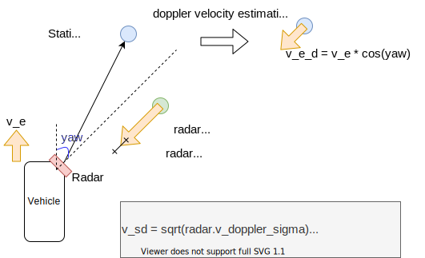

# radar_static_pointcloud_filter
## radar_static_pointcloud_filter_node

Extract static/dynamic radar pointcloud by using doppler velocity and ego motion.
Calculation cost is O(n). `n` is the number of radar pointcloud.

### Input topics

| Name           | Type                       | Description                |
| -------------- | -------------------------- | -------------------------- |
| input/radar    | radar_msgs::msg::RadarScan | RadarScan                  |
| input/odometry | nav_msgs::msg::Odometry    | Ego vehicle odometry topic |

### Output topics

| Name                      | Type                       | Description              |
| ------------------------- | -------------------------- | ------------------------ |
| output/static_radar_scan  | radar_msgs::msg::RadarScan | static radar pointcloud  |
| output/dynamic_radar_scan | radar_msgs::msg::RadarScan | dynamic radar pointcloud |

### Parameters

| Name              | Type   | Description                                                                                                           |
| ----------------- | ------ | --------------------------------------------------------------------------------------------------------------------- |
| min\_sd           | double | Minimum standard deviation for radar doppler velocity. [m/s] If radar topic do not have doppler\_sigma, apply min\_sd |
| magnification\_sd | double | Magnification for standard deviation of radar doppler velocity.                                                       |

### How to launch

```sh
ros2 launch radar_static_pointcloud_filter radar_static_pointcloud_filter.launch
```

### Algorithm


